# Analysis of SAE seed similarity

## Executive summary

The two SAEs are **strongly similar at the level of their overall activation geometry**, but they are **not close to being identical feature-by-feature**. This distinction is the main result of the evaluation.

- Global representation metrics are high: linear CKA is **0.838** (or **0.699** after feature standardization), mean SVCCA is **0.857**, and median canonical correlation is **0.942**.
- Matched features activate together far more than frequency-matched random controls: median activation Jaccard is **0.0804** over all matched pairs versus **0** for the random controls. The matched-minus-control median difference is **0.0800**, with standardized effect **0.826** and permutation **p = 9.999e-5**.
- The strongest feature correspondences are very convincing. The 5,803 pairs classified as shared have mean encoder/decoder cosine similarities of **0.839/0.873**, median activation Jaccard **0.420**, and median activation Pearson correlation **0.855**.
- Nevertheless, at the prespecified cosine threshold of 0.7, only **5,803 of 32,768 latents (17.7%)** qualify as shared. The remaining **82.3%** are labelled orphan under this strict definition. Encoder and decoder matchings select the same counterpart for only **49.6%** of seed-0 latents.

The most defensible conclusion is therefore:

> The two seeds learn substantially the same population-level representation and a clear core of highly reproducible features, while differing considerably in how the remaining representational content is divided among individual latent directions.

Calling the seeds simply “the same” would overstate the feature-level evidence. Calling them unrelated would ignore the strong global geometry, the high-similarity tail, and the activation controls.

## Experimental context

Both 32,768-latent TopK SAEs were trained for the same Pythia-160M hook (`blocks.6.hook_mlp_out`) and evaluated on the same 640,000 tokens (5,000 sequences of length 128). Representation metrics use 50,000 sampled token activations. Feature activity is defined as activation greater than zero. Encoder and decoder features are independently assigned with exact one-to-one Hungarian matching; a latent is called **shared** only when:

1. encoder and decoder assignments choose the same seed-1 counterpart; and
2. both matched cosine similarities are at least 0.7.

This is deliberately more stringent than asking whether each feature has some close neighbor.

## Plot-by-plot analysis

### CKA heatmap

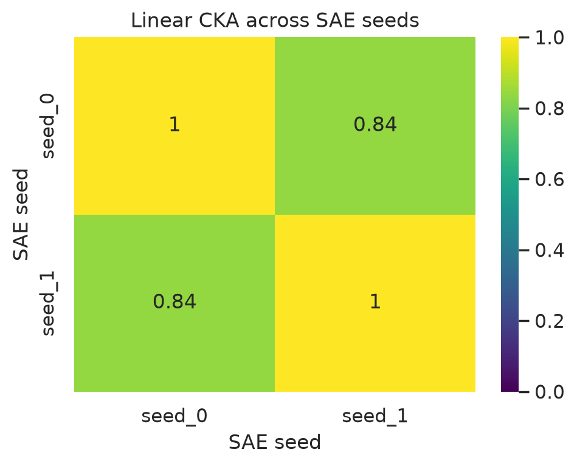

The off-diagonal linear CKA of **0.838** indicates strong agreement between the two complete latent activation spaces. The value is far above the shuffled-token control (**0.00020**) and reasonably close to the identity reference (**1.0**). CKA is invariant to orthogonal transformations and isotropic rescaling, so this supports similar population geometry rather than aligned feature identities. The standardized-feature CKA of **0.699** is lower, showing that part of the raw agreement is associated with the relative scales/variances of latent dimensions, but it remains substantial.

### SVCCA heatmap

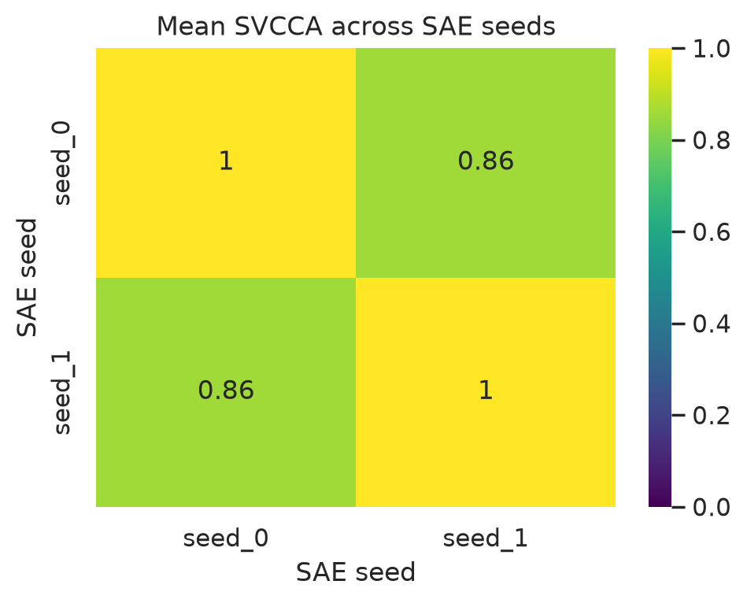

Mean SVCCA is **0.857**, again showing strong shared subspace structure. Its shuffled-token control is only **0.122**, while the identity value is **0.9997**. The median (**0.942**) exceeds the mean because most retained canonical directions align very well and a smaller low-correlation tail pulls down the mean.

This number needs one important qualification: the analysis capped PCA at 1,024 components. Those components explain only **83.9%** and **83.6%** of variance in seeds 0 and 1, so the configured 99% explained-variance target was not reached. The SVCCA result is therefore strong evidence for agreement in the leading 1,024-dimensional subspaces, not a complete measurement of all 32,768 latent dimensions.

### Canonical-correlation spectrum

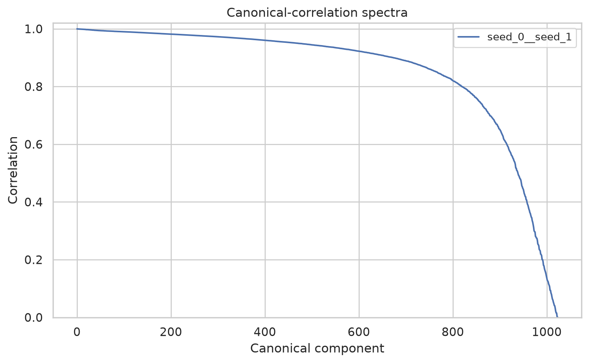

The spectrum stays high across most retained components and then drops sharply near its tail. Its quartiles are approximately **0.849, 0.942, and 0.977**; 90% of components exceed about **0.577**. This is not a result driven by only a handful of common dominant directions: hundreds of canonical directions are strongly aligned. The final low-correlation tail nevertheless demonstrates that the retained subspaces are not identical.

### PCA explained-variance curves

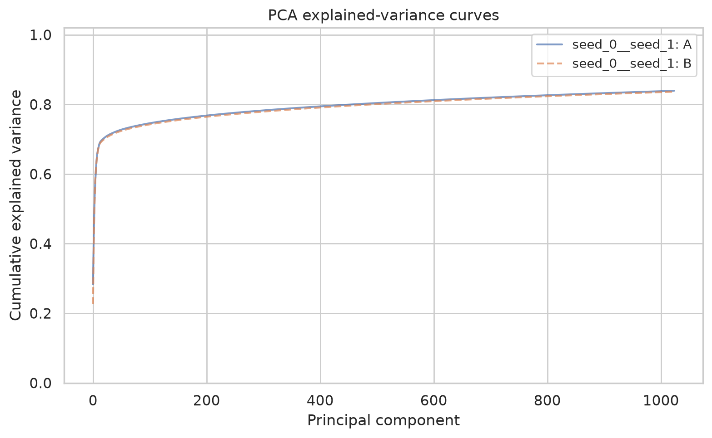

The two cumulative curves nearly overlap over all 1,024 components. Seed 0 reaches **0.8392** cumulative explained variance and seed 1 reaches **0.8365**. Their close shapes imply very similar activation variance spectra and effective dimensional structure. The first component differs somewhat (**28.4%** versus **22.6%**), but the discrepancy rapidly narrows. This supports seed stability at the distributional level even though it does not identify corresponding semantic features.

### Encoder/decoder Hungarian alignment

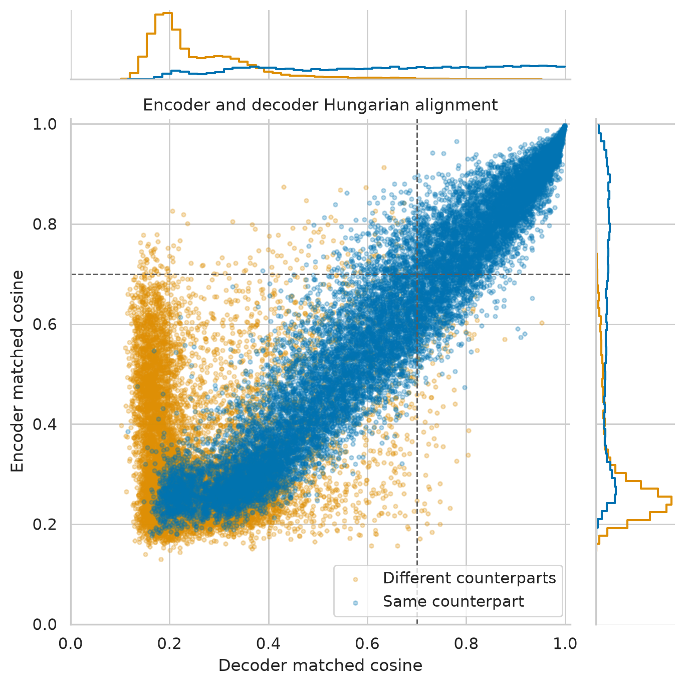

This figure reveals two regimes:

- A diagonal, high-similarity band contains features for which independently optimized encoder and decoder assignments agree. These include the strict shared features in the upper-right quadrant.
- A broad low-similarity population contains many different-counterpart assignments. It shows that seed differences are not merely permutations of the latent indices.

Only **16,264/32,768 (49.6%)** features receive the same encoder and decoder counterpart. Requiring both cosines to exceed 0.7 leaves **5,803 (17.7%)** strict shared features. Across all features, median encoder and decoder matched cosines are only **0.355** and **0.356** (means **0.450** and **0.444**), so averages alone conceal a mixture of weak and excellent matches.

### Shared/orphan fractions

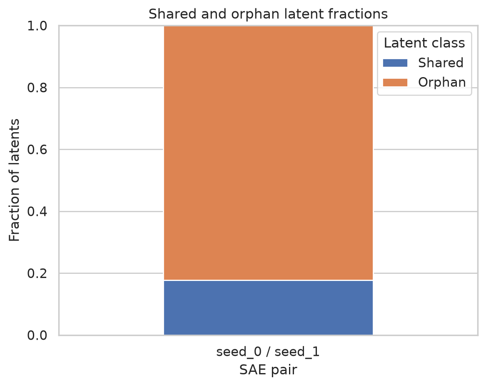

At threshold 0.7, **17.7%** are shared and **82.3%** are orphan. Here “orphan” should not be read as “meaningless,” “dead,” or “unique semantic concept.” It means that the feature fails at least one element of the joint assignment-and-threshold criterion. An orphan can still have a moderately similar counterpart, and some failures arise because encoder and decoder assignments compete for different one-to-one matches.

### Shared/orphan cosine distributions

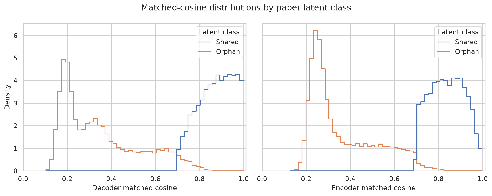

The distributions strongly separate the two classes, as expected from the definition, but also show useful internal structure:

| Class | Count | Median encoder cosine | Median decoder cosine | Median activation Jaccard | Median activation Pearson |
|---|---:|---:|---:|---:|---:|
| Shared | 5,803 | 0.840 | 0.879 | 0.420 | 0.855 |
| Orphan | 26,965 | 0.298 | 0.306 | 0.027 | 0.180 |

The shared population is a genuine reproducible core: its weight alignment is accompanied by strong agreement in when and how strongly features activate. The orphan population is heterogeneous rather than uniformly dissimilar; its long upper tails suggest partial matches, feature splitting/merging, and assignment competition.

### Threshold sweep

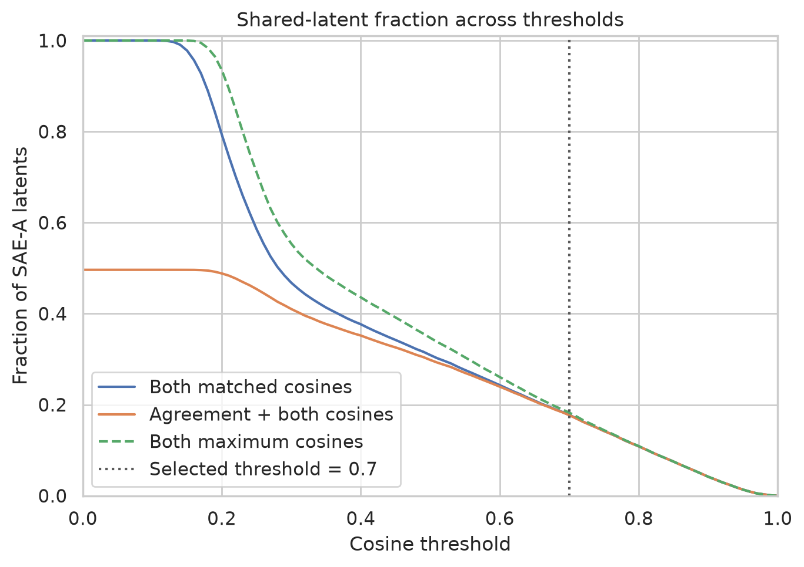

The inferred shared fraction is strongly threshold-dependent:

| Cosine threshold | Both matched cosines | Agreement plus both cosines | Both non-bijective maximum cosines |
|---:|---:|---:|---:|
| 0.2 | 79.3% | 48.8% | 93.5% |
| 0.3 | 46.8% | 41.0% | 55.4% |
| 0.4 | 37.7% | 35.2% | 43.6% |
| 0.5 | 30.9% | 29.8% | 34.7% |
| 0.6 | 24.3% | 24.0% | 26.1% |
| 0.7 | 17.8% | 17.7% | 18.3% |
| 0.8 | 10.9% | 10.9% | 10.9% |
| 0.9 | 4.17% | 4.17% | 4.17% |

At low thresholds, one-to-one assignment and encoder/decoder agreement—not cosine alone—are the main limitations. Above roughly 0.6, all definitions converge, meaning the strongest matches are unambiguous. The 17.7% headline is thus a valid result for a stringent 0.7 definition, but it is not a threshold-free estimate of the fraction of concepts shared by the models.

### Hungarian versus non-bijective maximum cosine (decoder)

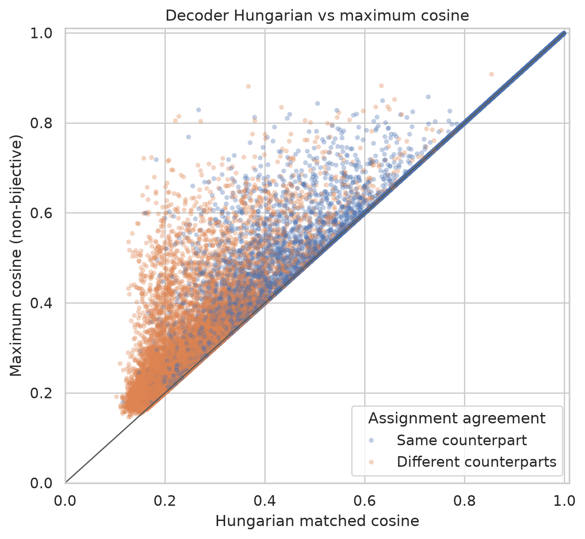

Every point lies on or above the diagonal because allowing every seed-0 feature to independently choose its nearest seed-1 neighbor cannot do worse than enforcing a bijection. Decoder assignment costs are usually small: the mean maximum-minus-Hungarian gap is **0.030**, the median is zero, and about **52.7%** of features have essentially no gap. The visible upper cloud shows collisions for weaker features, where several seed-0 directions prefer the same seed-1 direction. This is consistent with feature splitting, merging, or redundant low-quality directions.

### Hungarian versus non-bijective maximum cosine (encoder)

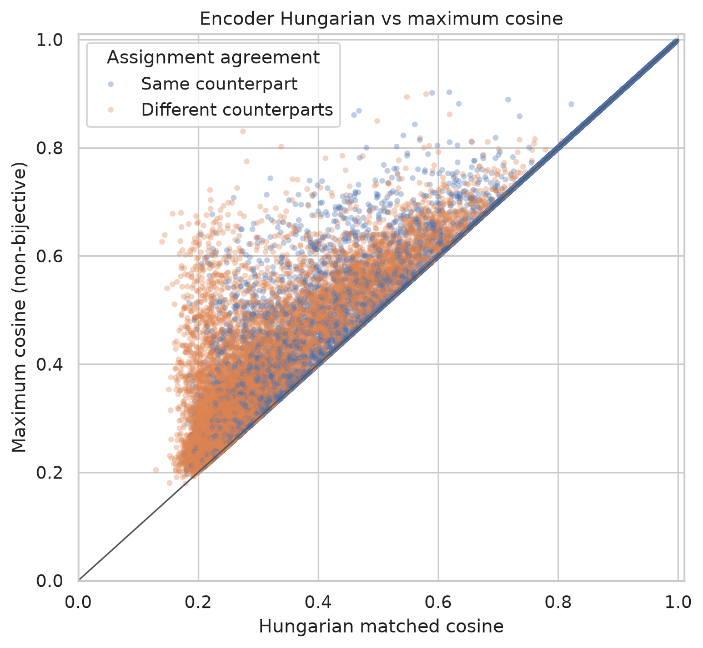

The encoder plot tells the same story, with a slightly larger mean assignment penalty (**0.0349**), median zero, and **50.4%** essentially gap-free. Encoder and decoder discrepancies matter because decoder similarity alone can overstate feature equivalence: two decoder directions can point similarly while their encoder selectivity differs.

### Decoder cosine versus activation Jaccard

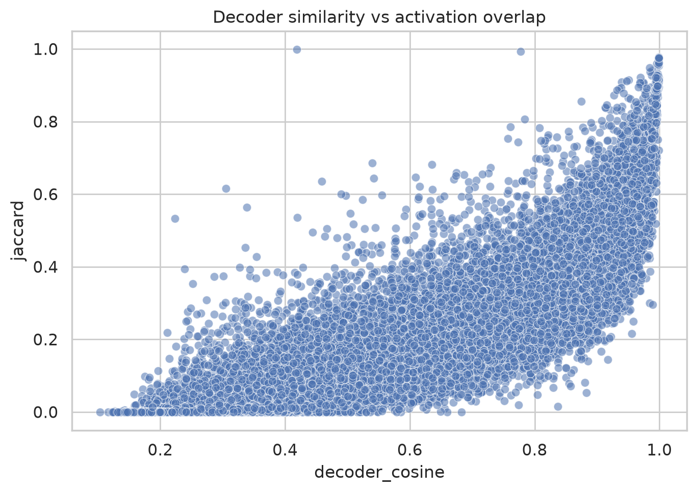

Weight similarity predicts functional co-activation strongly but imperfectly. Decoder cosine and activation Jaccard have Pearson correlation **0.869** and Spearman correlation **0.920**. High-cosine matches generally have substantial activation overlap, which validates the matching metric. The vertical spread—especially at intermediate cosine—shows why decoder geometry cannot replace activation-based evaluation: thresholds, encoder directions, biases, and activation magnitudes also determine whether a feature fires.

Across all matched pairs, activation Jaccard has median **0.080**, 75th percentile **0.262**, and 90th percentile **0.454**. Restricting to pairs in which both features fire at least once raises the median to **0.126**.

### Matched versus random activation overlap

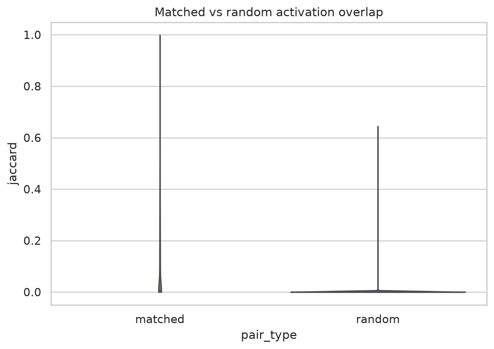

The violin plot is visually compressed by a large mass at zero and a small high-overlap tail, but the controls are decisive. Frequency-matched random pairs have mean Jaccard **0.00060** and median zero; shuffled-token pairs have mean **0.00058** and median zero. Matched pairs have median **0.0804**, and the permutation test gives **p = 9.999e-5**. Thus the observed feature matches encode real token-level correspondence rather than an artifact of common firing frequencies.

The identity control is exactly 1, providing a useful upper-bound sanity check. Some random-control outliers reach high Jaccard, but their distribution is overwhelmingly near zero; isolated rare-feature coincidences should not be interpreted as systematic similarity.

### Similarity versus firing frequency

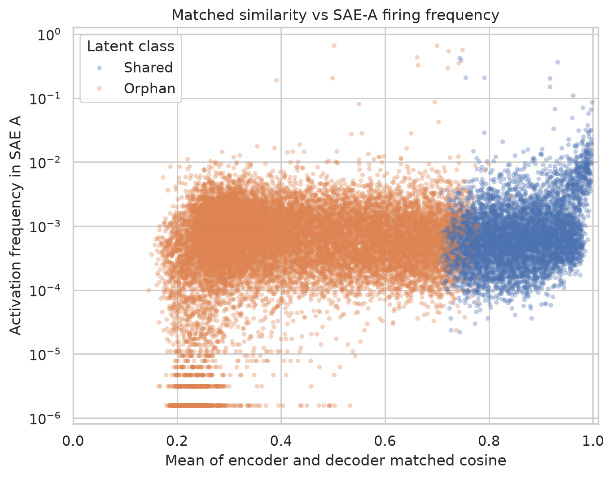

Shared features occupy the high-similarity region and tend to fire somewhat more frequently. Their mean seed-0 activation frequency is **0.00179**, compared with **0.000802** for orphans. The relationship is weak at the individual-feature level, however: correlation between average matched cosine and log firing frequency is only **0.202** (Pearson) or **0.104** (Spearman). Frequency therefore explains only a small part of feature reproducibility.

The horizontal bands at very low frequency reflect discrete counts in the finite 640,000-token sample. There are also substantial zero-activity counts: 9,005 seed-0 features and 8,362 matched seed-1 features never fire in this evaluation sample; 10,520 pairs have at least one inactive side. This makes conclusions about rare/orphan features less reliable and depresses aggregate activation-overlap statistics.

## Overall interpretation

The results support three claims of different strengths:

1. **Strong support: population-level seed stability.** CKA, SVCCA, canonical correlations, and nearly identical PCA spectra show that the two SAEs organize the sampled residual-stream activations in highly similar low-dimensional geometry.
2. **Strong support: a reproducible feature core.** Thousands of features independently align in encoder and decoder space and show high token-level activation agreement. This correspondence is far above appropriate random and shuffled controls.
3. **Limited support: complete dictionary recovery.** Most latents do not meet the strict feature-sharing definition, approximately half choose different encoder and decoder counterparts, and the results show collision/splitting behavior. The SAEs are therefore not related by a simple permutation of features.

This combination is compatible with superposition and non-identifiability: two SAEs can preserve much of the same representational subspace while choosing different sparse bases, especially for rare, weak, redundant, or split/merged features.

## Limitations and recommended follow-ups

- **Only two seeds were tested.** There is one cross-seed pair, so there is no estimate of between-seed variance or evidence that these results generalize to arbitrary initializations. Training at least 5 seeds would enable uncertainty intervals over seed pairs.
- **The SVCCA variance target was not reached.** Raise `max_components` beyond 1,024 if memory permits, or explicitly describe the current metric as truncated SVCCA over the leading components.
- **Many features are unobserved in the evaluation sample.** Increase token coverage and report overlap conditioned on minimum activation counts (for example, at least 50 or 100 firings in both SAEs).
- **The shared fraction depends on the 0.7 cutoff.** Report the full threshold curve or an area-under-curve summary alongside the selected-threshold number.
- **Correlation is not causal or semantic equivalence.** Inspect max-activating examples for shared and orphan pairs, and use feature ablation/steering or activation patching to test whether aligned features have interchangeable downstream effects.
- **Splits and merges require many-to-many analysis.** One-to-one Hungarian matching is intentionally strict. Complement it with neighborhood matching or sparse regression from one seed's latents to the other to quantify whether orphan features are recoverable as combinations.
- **Training quality should be compared directly.** Reconstruction loss, loss recovered, L0, dead-feature rate on a larger corpus, and downstream loss under SAE reconstruction are needed before claiming that the seeds are equally good, rather than merely similar.

## Bottom line

Your observation is correct with an important qualification: **the two seeds behave similarly as representations**, and a meaningful subset of their individual features behaves very similarly too. However, the feature dictionaries are only partially stable. The evidence favors “same broad representation, different sparse decomposition” over either “identical SAEs” or “independent solutions.”
